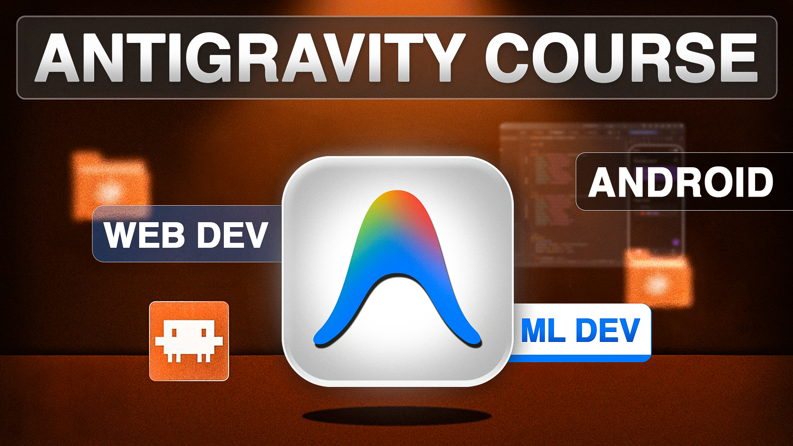

<div align="center">



<br>

# Google Antigravity Full Course 2026

<p><b>A complete practical course on Google Antigravity, Agentic Development, AI-assisted software development and building real Web, Android and Machine Learning projects.</b></p>

<p>
Google Antigravity · Agentic Development · Web Development · Android · Machine Learning · AI · Git · Docker
</p>

<br>


<br><br>

<table align="center" width="85%">
<tr>
<td align="center">

<h2>Google Antigravity Full Course</h2>

<p>
Learn how to work with AI agents to build real software projects<br>
while understanding planning, architecture, implementation, testing, debugging and deployment.
</p>

</td>
</tr>
</table>

<br>

<sub><em>This repository contains the source code and resources for the Google Antigravity Full Course 2026 by AiCodingHub.</em></sub>

</div>

---

## 📑 Table of Contents

<table width="100%">
<tr>

<td valign="top">

1. <a href="#1-overview">Overview</a><br>
2. <a href="#2-what-youll-learn">What You'll Learn</a><br>
3. <a href="#3-course-projects">Course Projects</a><br>
4. <a href="#4-agentic-development-workflow">Agentic Development Workflow</a><br>
5. <a href="#5-technology-stack">Technology Stack</a><br>
6. <a href="#6-real-time-chat-application">Real-Time Chat Application</a>

</td>

<td valign="top">

7. <a href="#7-modern-to-do-application">Modern To-Do Application</a><br>
8. <a href="#8-heart-disease-prediction">Heart Disease Prediction</a><br>
9. <a href="#9-calculator-application">Calculator Application</a><br>
10. <a href="#10-ai-assisted-development">AI-Assisted Development</a><br>
11. <a href="#11-testing--debugging">Testing & Debugging</a><br>
12. <a href="#12-git--version-control">Git & Version Control</a>

</td>

<td valign="top">

13. <a href="#13-project-structure">Project Structure</a><br>
14. <a href="#14-quick-start">Quick Start</a><br>
15. <a href="#15-course-resources">Course Resources</a><br>
16. <a href="#16-course-workflow">Course Workflow</a><br>
17. <a href="#17-author">Author</a>

</td>

</tr>
</table>

---

## 1. Overview

Google Antigravity Full Course 2026 is a practical course focused on using AI agents to build real software projects.

The course goes beyond simply generating code with AI. It demonstrates how to use AI throughout the complete software development workflow.

### Core Learning Flow

```text
REQUIREMENT
     ↓
PLANNING
     ↓
ARCHITECTURE
     ↓
AI AGENT
     ↓
IMPLEMENTATION
     ↓
TESTING
     ↓
DEBUGGING
     ↓
VERIFICATION
     ↓
GIT COMMIT
     ↓
DEPLOYMENT
```

The goal is to understand how to work with AI as a development partner instead of blindly accepting AI-generated code.

---

## 2. What You'll Learn

### Google Antigravity

- Google Antigravity
- Agentic Development
- AI-assisted software development
- AI coding workflows
- AI agents
- Agent-based project development
- Project planning
- Architecture planning
- Multi-step development
- AI-assisted implementation
- AI-assisted debugging
- AI-assisted testing
- AI-assisted project workflows

### Web Development

- React
- Vite
- Node.js
- Express.js
- MongoDB
- Redis
- Socket.IO
- Clerk Authentication
- Cloudinary
- REST APIs
- Real-time communication
- Production-oriented architecture
- Docker

### Android Development

- Kotlin
- Jetpack Compose
- MVVM
- Room Database
- Repository Pattern
- Coroutines
- Flow
- StateFlow
- Navigation Compose
- Offline-first development
- Android testing

### Machine Learning

- Python
- NumPy
- Pandas
- Scikit-learn
- Dataset inspection
- Data preprocessing
- Train/Test Split
- Model training
- Model evaluation
- Prediction
- Streamlit
- ML application development

### Production Development

- Project architecture
- Clean project structure
- Environment variables
- API configuration
- Validation
- Error handling
- Testing
- Debugging
- Git
- GitHub
- Docker
- Deployment workflow

---

## 3. Course Projects

This repository contains the projects built throughout the Google Antigravity course.

| Project | Category | Main Technologies |
|---|---|---|
| 💬 Real-Time Chat Application | Web Development | React, Node.js, Express, MongoDB, Redis, Socket.IO |
| 📱 Modern To-Do Application | Android Development | Kotlin, Jetpack Compose, Room, MVVM |
| 🧠 Heart Disease Prediction | Machine Learning | Python, NumPy, Pandas, Scikit-learn, Streamlit |
| 🧮 Calculator Application | Web Development | React, Vite |
| 📱 Android Project | Android Development | Kotlin, Jetpack Compose |

---

## 4. Agentic Development Workflow

The course focuses on using AI agents as part of a complete development workflow.

```text
IDEA
  ↓
REQUIREMENT
  ↓
PLANNING
  ↓
ARCHITECTURE
  ↓
BREAK INTO PHASES
  ↓
AI AGENT
  ↓
IMPLEMENTATION
  ↓
RUN
  ↓
TEST
  ↓
FIX
  ↓
VERIFY
  ↓
GIT COMMIT
  ↓
NEXT PHASE
```

Instead of giving one huge prompt and blindly accepting the result, the development process is divided into manageable phases.

Each phase is implemented, tested, verified and committed before moving forward.

---

## 5. Technology Stack

| Category | Technologies |
|---|---|
| AI Development | Google Antigravity |
| Web Frontend | React, Vite |
| Web Backend | Node.js, Express.js |
| Real-Time | Socket.IO |
| Database | MongoDB |
| Cache | Redis |
| Authentication | Clerk |
| File Storage | Cloudinary |
| Containerization | Docker |
| Android | Kotlin, Jetpack Compose |
| Android Database | Room |
| Android Architecture | MVVM |
| Machine Learning | Python, Scikit-learn |
| Data Processing | NumPy, Pandas |
| ML Interface | Streamlit |
| Version Control | Git, GitHub |

---

## 6. Real-Time Chat Application

A production-oriented real-time chat application built using modern web technologies and AI-assisted development.

### Features

- User authentication
- Direct conversations
- Group conversations
- Real-time messaging
- Online presence
- Typing indicators
- Message delivery status
- Read receipts
- Message reactions
- Message editing
- Message deletion
- Image and file sharing
- Pagination
- Search
- Reconnection handling
- Rate limiting
- Redis integration
- Docker support
- Production-oriented architecture

### Technology Stack

```text
Frontend
React
Vite

Backend
Node.js
Express.js

Database
MongoDB

Cache
Redis

Real-Time Communication
Socket.IO

Authentication
Clerk

File Storage
Cloudinary

Containerization
Docker
```

### Architecture

```text
                 React + Vite
                       |
                       ↓
                Node.js + Express
                   /           \
                  ↓             ↓
              MongoDB         Redis
                  |
                  ↓
              Socket.IO
                  |
                  ↓
        Real-Time Communication
```

### Application Flow

```text
User
 ↓
React Frontend
 ↓
Authentication
 ↓
REST API / Socket.IO
 ↓
Express Backend
 ↓
MongoDB / Redis
 ↓
Real-Time Response
```

---

## 7. Modern To-Do Application

A modern Android To-Do application built using Kotlin and Jetpack Compose.

### Features

- Add tasks
- Edit tasks
- Delete tasks
- Complete tasks
- Task priorities
- Due dates
- Categories
- Search
- Filtering
- Sorting
- Active tasks
- Completed tasks
- Calendar
- Offline-first data
- Modern UI
- Dark mode
- Unit testing
- Instrumented testing

### Technology Stack

```text
Kotlin
Jetpack Compose
Room Database
MVVM
Repository Pattern
Coroutines
Flow
StateFlow
Navigation Compose
Android Testing
```

### Architecture

```text
Jetpack Compose UI
        ↓
    ViewModel
        ↓
   Repository
        ↓
      DAO
        ↓
 Room Database
        ↓
     SQLite
```

---

## 8. Heart Disease Prediction

A machine learning project demonstrating the complete workflow from dataset inspection to prediction.

### Machine Learning Workflow

```text
Dataset
   ↓
Data Inspection
   ↓
Data Preprocessing
   ↓
Train / Test Split
   ↓
Model Training
   ↓
Model Evaluation
   ↓
Prediction
   ↓
Streamlit Application
```

### Technology Stack

```text
Python
NumPy
Pandas
Scikit-learn
Streamlit
```

### Libraries

#### NumPy

Used for numerical computing, arrays and mathematical operations.

#### Pandas

Used for data processing and working with tabular datasets.

#### Scikit-learn

Used for machine learning algorithms, preprocessing and model evaluation.

#### Streamlit

Used to create the web interface for the machine learning application.

> ⚠️ This project is created for educational purposes and is not a medical diagnostic tool.

---

## 9. Calculator Application

A simple web-based calculator application created as part of the practical development workflow.

### Technology Stack

```text
React
Vite
JavaScript
CSS
```

---

## 10. AI-Assisted Development

One of the main goals of this course is learning how to use AI correctly during software development.

AI is not treated as a replacement for understanding software development.

Instead, the workflow is:

```text
Requirement
     ↓
Planning
     ↓
Architecture
     ↓
AI Agent
     ↓
Implementation
     ↓
Review
     ↓
Testing
     ↓
Debugging
     ↓
Verification
     ↓
Git Commit
```

The developer should always understand and verify the generated implementation.

### AI Development Principles

- Understand before implementing
- Plan before prompting
- Build in phases
- Review generated code
- Run the project
- Test each feature
- Understand errors
- Fix problems
- Verify the result
- Commit working changes

---

## 11. Testing & Debugging

Testing is an important part of the development workflow.

```text
Implementation
      ↓
Run Application
      ↓
Test Feature
      ↓
Find Error
      ↓
Understand Error
      ↓
Fix Error
      ↓
Run Again
      ↓
Verify
```

AI can help identify and fix errors, but the developer should understand what caused the problem.

### Verification Process

```text
Feature Implemented
        ↓
Application Runs
        ↓
Feature Tested
        ↓
Errors Checked
        ↓
Existing Features Checked
        ↓
Final Verification
        ↓
Git Commit
```

---

## 12. Git & Version Control

Git is used to track project changes throughout development.

### Basic Workflow

```text
Build
 ↓
Test
 ↓
Fix
 ↓
Verify
 ↓
Commit
 ↓
Push
```

### Example

```bash
git add .
git commit -m "feat: add feature"
git push
```

Meaningful commits help maintain a clean development history.

---

## 13. Project Structure

```text
google-antigravity-course/
│
├── Heart_Disease_Prediction/
│   ├── src/
│   ├── app.py
│   ├── requirements.txt
│   └── README.md
│
├── To-Do App/
│   ├── app/
│   ├── gradle/
│   ├── gradlew
│   ├── build.gradle.kts
│   └── settings.gradle.kts
│
├── android/
│   ├── app/
│   ├── gradle/
│   ├── gradlew
│   ├── build.gradle.kts
│   └── settings.gradle.kts
│
├── calculator-app/
│   ├── src/
│   ├── package.json
│   ├── package-lock.json
│   └── vite.config.js
│
├── real-time-chat/
│   ├── backend/
│   │   ├── src/
│   │   ├── tests/
│   │   ├── Dockerfile
│   │   └── package.json
│   │
│   ├── frontend/
│   │   ├── src/
│   │   ├── tests/
│   │   ├── Dockerfile
│   │   └── package.json
│   │
│   ├── docker-compose.yml
│   ├── render.yaml
│   └── test-all.sh
│
├── .gitignore
├── README.md
└── final.png
```

---

## 14. Quick Start

### Clone Repository

```bash
git clone https://github.com/allknowledge34/google-antigravity-course.git

cd google-antigravity-course
```

### Real-Time Chat Application

#### Backend

```bash
cd real-time-chat/backend

npm install

npm run dev
```

#### Frontend

Open another terminal:

```bash
cd real-time-chat/frontend

npm install

npm run dev
```

Configure the required environment variables using the provided `.env.example` files.

### Android Projects

Open the project in Android Studio.

Available Android projects:

```text
To-Do App/
android/
```

Sync Gradle dependencies and run the application using an Android emulator or physical device.

### Machine Learning Project

```bash
cd Heart_Disease_Prediction
```

Create a virtual environment:

```bash
python -m venv .venv
```

### macOS / Linux

```bash
source .venv/bin/activate
```

### Windows

```bash
.venv\Scripts\activate
```

Install dependencies:

```bash
pip install -r requirements.txt
```

Run Streamlit:

```bash
streamlit run app.py
```

---

## 15. Course Resources

### 🎥 Full Course

**Google Antigravity Full Course 2026**

[Watch the Complete Course]([https://www.youtube.com/](https://youtu.be/QQ_OmvcccNg?si=n8N48H1P45HJEs-Y))

### 📂 Source Code

[GitHub Repository](https://github.com/allknowledge34/google-antigravity-course)

### 📄 PDF Notes

[Download Course Notes](https://drive.google.com/file/d/1bX6pHWfq-8AkvSuQITiJIA-1zuLvzeC5/view?usp=sharing)

### 🎬 Related Tutorials

- [Advanced Django Full Course](https://youtu.be/4dUvcZboj7c)
- [Django Social Media Project](https://youtu.be/huz2WThjxyg)
- [REST API Complete Tutorial](https://youtu.be/iNakaKtoSyo)
- [VPS Deployment Tutorial](https://youtu.be/u7BMmOC9I18)

### 🌐 Useful Resources

- [Freelancer Blog](https://www.tralance.pro/blog)
- [Freelancer Tools](https://www.tralance.pro/tools)
- [Tralance Android App](https://play.google.com/store/apps/details?id=com.sachin.tralance)

---

## 16. Course Workflow

The complete course follows a practical development journey:

```text
Google Antigravity Basics
        ↓
Agentic Development
        ↓
Web Development
        ↓
Real-Time Chat Application
        ↓
Docker
        ↓
Redis & Real-Time Infrastructure
        ↓
Android Development
        ↓
Modern To-Do Application
        ↓
Machine Learning
        ↓
Heart Disease Prediction
        ↓
AI-Assisted Development
        ↓
Testing & Debugging
        ↓
Git & Version Control
        ↓
Production Development Workflow
```

### Final Development Philosophy

```text
Don't just ask AI to build.

Understand the requirement.
        ↓
Plan the solution.
        ↓
Design the architecture.
        ↓
Let AI implement.
        ↓
Review the code.
        ↓
Run and test.
        ↓
Fix the problems.
        ↓
Verify everything.
        ↓
Commit the working result.
```

---

## 17. Author

<div align="center">

### AiCodingHub

**Learn. Build. Understand.**

[YouTube](https://www.youtube.com/channel/UCboKmnJcR4j6XsJ3dQgaozQ)

[LinkedIn](https://www.linkedin.com/in/sachin-kumar-355203340/)

<br>

⭐ If this repository helped you, consider giving it a star.

<br>

### Google Antigravity Full Course 2026

<p>
Build real projects. Work with AI agents. Understand what AI builds.
</p>

</div>
